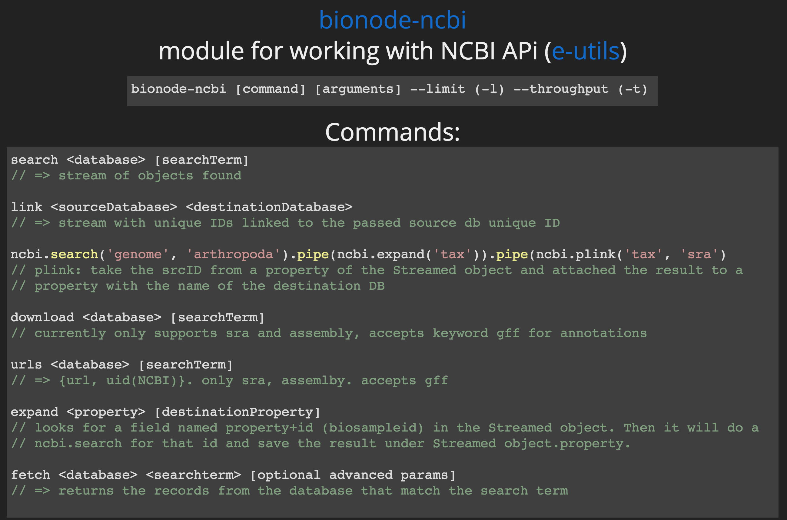
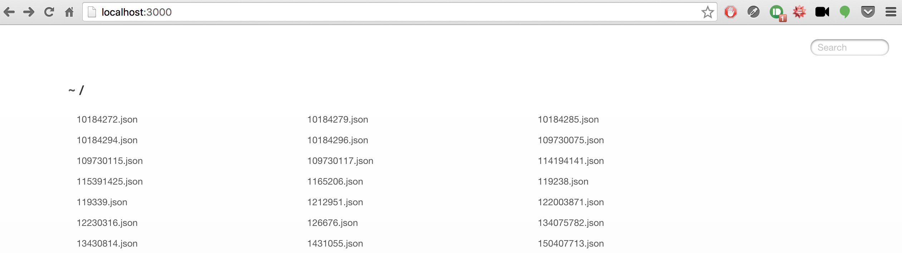
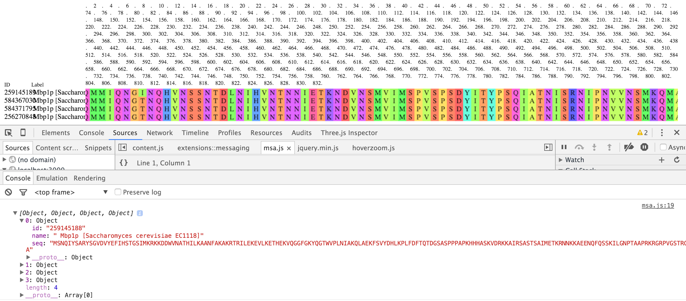

# js-bioinformatics-exercise

The tutorial for this [exercise][exercise] as part of my presentation on [JavaScript and Bioinformatics][js-and-bioinformatics].

[exercise]: https://slides.com/jmazz/js-bioinformatics/fullscreen#/37
[js-and-bioinformatics]: https://slides.com/jmazz/js-bioinformatics/fullscreen

## Setting up the project

The first thing you do when starting any modern JavaScript project is initialize
it (`cd` into your project directory and):

```bash
npm init
```

You will be asked to provide values for certain keys. The `name` will default to
the current directory. It's perfectly fine to just enter through everything.
This will create a `package.json` file. This file defines everything about your
package in order to publish it to npm, define  development dependencies and
project dependencies, to run arbitrary scripts, as well as interoperate with
other tools. For example, linters, like [jshint][jshint] can have it's options
specified from either a `.jshintrc` file or inside `package.json` under the
`jshint` key. After running this, my `package.json` looks like this (I switched
to MIT license):

```json
{
  "name": "js-bioinformatics-exercise",
  "version": "1.0.0",
  "description": "The tutorial for this [exercise][exercise] as part of my presentation on [JavaScript and Bioinformatics][js-and-bioinformatics].",
  "main": "index.js",
  "scripts": {
    "test": "echo \"Error: no test specified\" && exit 1"
  },
  "repository": {
    "type": "git",
    "url": "git+https://github.com/thejmazz/js-bioinformatics-exercise.git"
  },
  "author": "",
  "license": "MIT",
  "bugs": {
    "url": "https://github.com/thejmazz/js-bioinformatics-exercise/issues"
  },
  "homepage": "https://github.com/thejmazz/js-bioinformatics-exercise#readme"
}
```

## Getting Dependencies

Let's get started by downloading [bionode-ncbi][bionode-ncbi] **and** making
sure to store it under our dependencies by using the `--save` option:

```bash
npm install bionode-ncbi --save
```

You'll now notice the following has been added to the `package.json`

```json
{
    "dependencies": {
        "bionode-ncbi": "^1.6.0"
    }
}
```

As well, `bionode-ncbi` lives at `node_modules/bionode-ncbi`. You don't commit
this `node_modules` folder - when someone downloads this package they can simply
run `npm install` and it will install everything under the `dependencies` and
`devDependencies` keys. Thus managing dependencies in the npm ecosystem is
simple *and* robust. Note as well, when we installed bionode-ncbi, it ran `npm
install` inside the bionode-ncbi folder, and ever deeper for each dependency.

## bionode-ncbi

Refer to my [slide][slide-bionode-ncbi-api] overviewing the bionode-ncbi API.



This allows us to access the NCBI [E-utilities][e-utilities] through callbacks,
events, and streams. Which to use is up to you. Check out
[try-bionode-esnext][try-bionode-esnext]. This uses ES6 syntax but the concepts
are the same. For this tutorial I'll stick to ES5 however. Let's start writing
`main.js`:

```js
var ncbi = require('bionode-ncbi');
var fs = require('fs');

var query = ncbi.search('protein', 'mbp1');

function dataLogger(data) {
    // Assumes `data` directory already exists
    var fileName = 'data/' + data.uid + '.json';
    fs.writeFileSync(fileName, JSON.stringify(data));
    console.log('Wrote ' + fileName);
}

query.on('data', dataLogger);
```

We require `bionode-ncbi` and `fs` (filesystem) modules. `query` is the object
returned by `ncbi.search`. It emits a `data` event, which we catch and pass
`dataLogger` as the callback. This simply writes the retrieved JSON to the
folder `data`. (You will need to `mkdir data` first - just didn't want to
introduce checking if the dir exists, then make it, etc. into this minimal
example).

To run this,

```bash
node main.js
```

At this point you can `ls data` and see what turned up!

## Static File Server with Express

There are quite a lot of results. These are all from different organisms. To be
able to quickly browse through them, we can set up an [express][express] static
file server with [serve-index][serve-index], in `server.js`:

```js
var express = require('express');
var serveIndex = require('serve-index');

var app = express();

app.use(serveIndex('data'));
app.use(express.static('data'));

app.listen(3000);

console.log('Express server listening on port 3000');
```

Start the server with `node server.js` and navigate to `http://localhost:3000` in
your web browser. You can now easily browse through the files. I *highly*
recommend the Chrome addon [JSON
Formatter](JSON-Formatter). This is what you should see:



I like browsing through these JSONS more than the webpage search results. It
just feels more semantic. Would be nice to implement left/right arrow to move
between the files..but for now this suits our purposes to get a quick overview
of the data we are dealing with..and more specifically, the general format. One
way to generate a generic schema would be to loop through each file and keep
track of the keys and `typeof(result[key])` that are common among all.

Take a look at [1431055.json][1431055.json]. Disclaimer: I got `1431055` from the web
results - instead of looking through each file - we could do that
programmatically of course though.

## Multiple Sequence Alignment

We have all these results for Mbp1 proteins in different organisms - why not
run an MSA and see if any regions are more conserved than others? To do this
we will need to retrieve sequences. For that, we can use the `fetch` function
from bionode-ncbi. Check out the table for [Entrez eFetch Databases](eFetch).
Run the following just to test it out (after installing bionode-ncbi globally
so we can use it in the shell - `npm install -g bionode-ncbi`):

```bash
bionode-ncbi fetch protein 1431055
```

This returns:

```json
{
    "id":"gi|1431055|emb|CAA98618.1| MBP1 [Saccharomyces cerevisiae]",
    "seq":"MSNQIYSARYSGVDVYEFIHSTGSIMKRKKDDWVNATHILKAANFAKAKRTRILEKEVLKETHEKVQGGFGKYQGTWVPLNIAKQLAEKFSVYDQLKPLFDFTQTDGSASPPPAPKHHHASKVDRKKAIRSASTSAIMETKRNNKKAEENQFQSSKILGNPTAAPRKRGRPVGSTRGSRRKLGVNLQRSQSDMGFPRPAIPNSSISTTQLPSIRSTMGPQSPTLGILEEERHDSRQQQPQQNNSAQFKEIDLEDGLSSDVEPSQQLQQVFNQNTGFVPQQQSSLIQTQQTESMATSVSSSPSLPTSPGDFADSNPFEERFPGGGTSPIISMIPRYPVTSRPQTSDINDKVNKYLSKLVDYFISNEMKSNKSLPQVLLHPPPHSAPYIDAPIDPELHTAFHWACSMGNLPIAEALYEAGTSIRSTNSQGQTPLMRSSLFHNSYTRRTFPRIFQLLHETVFDIDSQSQTVIHHIVKRKSTTPSAVYYLDVVLSKIKDFSPQYRIELLLNTQDKNGDTALHIASKNGDVVFFNTLVKMGALTTISNKEGLTANEIMNQQYEQMMIQNGTNQHVNSSNTDLNIHVNTNNIETKNDVNSMVIMSPVSPSDYITYPSQIATNISRNIPNVVNSMKQMASIYNDLHEQHDNEIKSLQKTLKSISKTKIQVSLKTLEVLKESSKDENGEAQTNDDFEILSRLQEQNTKKLRKRLIRYKRLIKQKLEYRQTVLLNKLIEDETQATTNNTVEKDNNTLERLELAQELTMLQLQRKNKLSSLVKKFEDNAKIHKYRRIIREGTEMNIEEVDSSLDVILQTLIANNNKNKGAEQIITISNANSHA"
}
```

Sweet, so we will be able to get sequences. However, not all of the search
results are worth comparing - let's filter out the ones that have `mbp1` in
their title. The following code achieves that, in `collect-seqs.js`:

```js
var fs = require('fs');

// return array of uids of proteins with title containing `mbp1`
function filter(proteins, cb) {
    var num = 0;
    var filtered = [];

    var check = function(err, data) {
        if (err) cb(err);

        num+= 1;
        var obj = JSON.parse(data);
        if (obj.title !== undefined && obj.title.toUpperCase().indexOf('MBP1') >= 0) {
            filtered.push(obj.uid);
        }
        tryFinish();
    };

    var tryFinish = function() {
        if (num === proteins.length) {
            cb(null, filtered);
        }
    };

    proteins.forEach(function(protein) {
        fs.readFile('data/' + protein, check);
    });
}

filter(fs.readdirSync('data'), function(err, mbp1s) {
    if (err) console.error(err);

    mbp1s.forEach(function(uid) {
        fs.readFile('data/' + uid + '.json', function(err, data) {
            if (err) console.error(err);

            var obj = JSON.parse(data);
            console.log(obj.title);
        });
    });
});
```

Now, that's pretty callback heavy. What is happening here and why? JavaScript
has one event loop, and only one function can run at a time. Thus the standard
way to *consume* asynchronous operations (i.e. those which will take time - for
example, reading the contents of a file or waiting for a web request) is
the idiomatic `function(err,data)`. For example, reading a file:

```js
fs.readFile('arbitraryBytes.ab', function(err, data) {
    // handle error (poorly in this case)
    if (err) console.error(err);

    // do stuff with data!
    var obj = JSON.parse(data);
})
```

But how do we *produce* these asynchronous operations? We define a function
that takes a **callback** function as a parameter. Then when everything is
really done, we call that function with our result: `cb(null, data)` or if
something goes wrong, pass the error to it: `cb(err)`.

So what is happening in `filter`? First, we read every file that was passed
in:

```
proteins.forEach(function(protein) {
    fs.readFile('data/' + protein, check);
});
```

Instead of writing an inline function, `check` is declared elsewhere. `check` is
an *impure* function which has side effects - it increments `num` each time it
is called. When `check` is finished what it it will call `tryFinish`.
`tryFinish` simply checks if `num === proteins.length`, i.e. have all the files
been read and parsed. We do not know the order that these files were processed -
and it will be different each time. Thus, an alternative is to assign the result
into a fixed index in an array (yes, `var a = []; a[5] = 'five'` is totally
valid JS). In this case the order is not too important so I just threw the uids
in there. Finally, when `tryFinish` discovers that we have in fact processed
every file, it calls `cb` with the `null` as the error, and the produced data.

You might be beginning to notice what is called **callback hell**. There are
methods to avoid this endlessly indented dread however - you can chain
`.then()`s of [Promises][promise-mdn] (See also
[bluebird](https://github.com/petkaantonov/bluebird),
[q](https://github.com/kriskowal/q)). ES6 introduces
[generators](http://www.2ality.com/2015/03/no-promises.html) which are a neat
type of "iterator" that you can pass in data to them mid state with
`next(datum)`. Promises and generators can be combined (in a way which was not
originally intended but works great!) and ran through a "generator engine" of
some sort (like [co](https://github.com/tj/co)) and the result is **asynchronous
code that looks synchronous**. Co essentially implements what is in the draft
for ES7, `async/await`. Check out [try-bionode-esnext][try-bionode-esnext] to
see this next-next-generation JS put to use to consume callbacks without
indenting. Browsers are [beginning to
implement](https://kangax.github.io/compat-table/es6/) ES6 features, in the
meantime you can use [Babel](http://babeljs.io/) to transpile ES6 into ES5.
Extra note: `Promise.all([...])` is also quite useful and can be used to wait
for a bunch of async operations to finish.

That was quite a bit. But if you got here, and understand `collect-seqs.js`
thats great. Coming to grips with callbacks is central to understanding how
async operations are handled in a language that runs on one thread. You may
think, wow, one thread that doesn't sound too great! But it actually makes for
easily scalable RESTful APIs - on any request the server can take it without
being stuck handling someone else - the callbacks will flow in when they are
ready.  

Take a look at the [output][collect-seqs-output] `node collect-seqs.js`
produces. Lines `156` to `257` look interesting, they are all from
*Saccharomyces cerevisiae* strains. Wonder how much conservation is there? For
now though - let's just compare everything - the filtering function is not that
clean and fairly  hardcoded.

## Pipes

As you can see, this data filtering pipeline which has been developed so far is
beginning to become clouded by async idioms and basically - code. It's important
to keep a clear and concise focus on what our code should achieve and how the
purpose is readable from an outside observer. Yes, new ES6/ES7 features can make
it much cleaner, but we are wasting time repeatedly writing and reading files.
Wouldn't it be great if there was some way to process data piece by piece as it
came in from the Internet? It would - and this is called a
[stream](https://nodejs.org/api/stream.html). If there is a package for R for
dealing with BLOB streams please let me know, a quick Google search brought
[this](https://cran.r-project.org/web/packages/stream/vignettes/stream.pdf) but
that does not appear at first glance terribly similar. Stream support in R would
make for fantastic interoperability with bionode/gasket.

Lets revisit this data acquisition and filtering pipeline in the context of the
stream APIs bionode provides, in `piped.js`:

```js
var ncbi = require('bionode-ncbi');
var es = require('event-stream');
var filter = require('through2-filter');

ncbi.search('protein', 'mbp1')
    .pipe(filter.obj(function (obj) {
        return obj.title.match(/^Mbp1p \[Saccharomyces cerevisiae/);
    }))
    .pipe(es.through(function (data) {
        this.emit('data', data.title + '\n');
    }))
    .pipe(process.stdout);
```

That produces this [output](https://github.com/thejmazz/js-bioinformatics-exercise/blob/master/outputs/piped1.txt).

Why didn't we just do this in the first place you might ask? It's very important
to understand callbacks - also, these different approaches may be superior
in different scenarios.

There are a lot of `YJM*` strains - let's just take these out for now and
compare `EC1118`, `R008`, `P301`, and `JAY291`. The regex is changed to `/^Mbp1p \[Saccharomyces cerevisiae [^Y]/` in `piped2.js` as well as some other changes:

```js
var ncbi = require('bionode-ncbi');
var es = require('event-stream');
var filter = require('through2-filter');
var concat = require('concat-stream');
var tool = require('tool-stream');

var concatStream = concat(function(array) {
    console.log(array);
});

ncbi.search('protein', 'mbp1')
    .pipe(filter.obj(function (obj) {
        return obj.title.match(/^Mbp1p \[Saccharomyces cerevisiae [^Y]/);
    }))
    .pipe(tool.extractProperty('gi'))
    .pipe(ncbi.fetch('protein'))
    .pipe(concatStream);
```

and produces this
[output][piped2.txt] which is an array of objects.

### Into the Browser

At the moment, there is no standard way of importing modules in the browser.
That is, `require` is undefined. With ES6 `import` and `export` will be
available! We will use [Browserify](http://browserify.org/) to bundle our
scripts from an entry point. Install browserify (`npm install -g browserify`)
and bundle `piped2.js` into `bundle.js` with the debug option so we get source
maps:

```bash
browserify piped2.js -o public/bundle.js --debug
```

Now, I actually get an error doing this:

```bash
Error: Cannot find module 'browserify-fs' from '/Users/jmazz/Documents/repos/js-bioinformatics-exercise/node_modules/bionode-ncbi/node_modules/bionode-fasta/lib'
    ...
```

Perhaps someone missed the `--save` on `npm install browserify-fs`. Looking into
`node_modules/bionode-ncbi/node_modules/bionode-fasta/package.json`, indeed, it
is not in `dependencies`. But it is in `devDependencies`! And as well there is:

```json
"browser": {
    "fs": "browserify-fs"
}
```

The `browser` object is for browserify. So there definitely has been attempt
to make this work. Either way, we can get around this by doing

```
browserify piped2.js -o public/bundle.js --debug -r fs:browserify-fs
```

as I gathered from the [browserify-fs readme](https://www.npmjs.com/package/browserify-fs). Another solution would
have been to `npm install browserify-fs` inside `bionode-fasta`. However you
should avoid modifying dependencies - and if you do - you should issue a pull
request.

Then create a simple `public/index.html`:

```html
<!doctype html>
<html>
    <body>
        <script src="bundle.js"></script>
    </body>
</html>
```

With some small modifications to `server.js` we can get this running (It's important
to run through a localhost since opening html files with the browser doesn't let
you do as many things):

```js
app.use('/data', serveIndex('data'));
app.use('/data', express.static('data'));

app.use(express.static('public'));
```

View it in chrome and open up developer tools (`cmd`+`option`+`i` on OS X, or right-click->inspect). You will see there is an error:

```
Uncaught TypeError: Cannot read property 'write' of undefined, index.js:6
```

Expanding the error and looking through the trace, I find that line 43 makes
this call:

```js
module.exports.stdout = module.exports(process.stdout);
```

where in line 5 and 6 we have

```js
module.exports = function(stream) {
    var write = stream.write;
    // ...
}
```

Hmm, do we have `process` in the browser? Nope. Hence `process.stdout.write`
will fail. Browserify is supposed to replace these things - see [advanced
options](https://github.com/substack/node-browserify#usage). However, I think
this requires `require('process')` to work? Passing in `--insert-globals` didn't
do the trick either. After inspecting the code this was my hacky fix:

In `node_modules/bionode-ncbi/node_modules/nugget/package.json` I added

```json
"browser": {
    "single-line-log": false
}
```

Essentially just ignoring the module that is causing the issue. This is safe
because `single-line-log` won't get used unless we use the `verbose` option -
which apparently is not being passed due to this hack working..
[browser-stdout](https://github.com/kumavis/browser-stdout) and
[process](https://www.npmjs.com/package/process) exist, and perhaps I'll put
together a pull request implementing those sometime.

Note: Most of the time, browserify works wonderfully! Pure-js modules will
always work. Obviously there will be little issues when porting Node server code
into the browser. It's unlikely the
[single-line-log](https://github.com/freeall/single-line-log) author expected
his module to be used in the browser.

I've written
[fix-nugget](https://github.com/thejmazz/js-bioinformatics-exercise/blob/master/fix-nugget.js)
for this, and added it the postinstall script. So now at least anyone pulling
*this* repository won't have those issues.

### BioJS: MSA

Browsing through the [msa readme](https://github.com/greenify/msa), I took the
"b) Import your own seqs" snippet and the "sequence model", to produce `msa.js`:

```js
var msa = require("msa");
// other requires from piped2.js

var msaDiv = document.createElement('div');
document.body.appendChild(msaDiv);

var concatStream = concat(function(sequences) {
    sequences = sequences.map(function(seq) {
        var props = seq.id.split('|');
        seq.id = props[1];
        seq.name = props[4];
        return seq;
    });

    console.log(sequences);
    var m = new msa({
        el: msaDiv,
        seqs: sequences
    });
    m.render();
});

// ncbi.search from piped2.js
```

Then ran `npm run bundle`. (see `scripts` in `package.json`). I logged `sequences`
so I can determine the schema msa wants..something which was missing from their
documentation. Comparing the generated array, and our pipe created array,
they look fairly similar.



We just need to refine `id`, produce `name`. `meta` is an empty object so we
can probably leave that for now.


[jshint]: http://jshint.com/
[bionode-ncbi]: https://github.com/bionode/bionode-ncbi
[slide-bionode-ncbi-api]: http://slides.com/jmazz/js-bioinformatics/fullscreen#/11
[e-utilities]: http://www.ncbi.nlm.nih.gov/books/NBK25500/
[try-bionode-esnext]: https://gist.github.com/thejmazz/fbec1d50e6ed14401ad9
[express]: http://expressjs.com/en/index.html
[serve-index]: https://github.com/expressjs/serve-index
[JSON-Formatter]: https://chrome.google.com/webstore/detail/json-formatter/bcjindcccaagfpapjjmafapmmgkkhgoa?hl=en
[eFetch]: http://www.ncbi.nlm.nih.gov/books/NBK25497/table/chapter2.T._entrez_unique_identifiers_ui/?report=objectonly
[collect-seqs-output]: https://github.com/thejmazz/js-bioinformatics-exercise/blob/master/outputs/collect-seqs.txt
[promise-mdn]:https://developer.mozilla.org/en/docs/Web/JavaScript/Reference/Global_Objects/Promise
[piped2.txt]:https://github.com/thejmazz/js-bioinformatics-exercise/blob/master/outputs/piped2.txt
[1431055.json]:https://github.com/thejmazz/js-bioinformatics-exercise/blob/master/outputs/1431055.json
