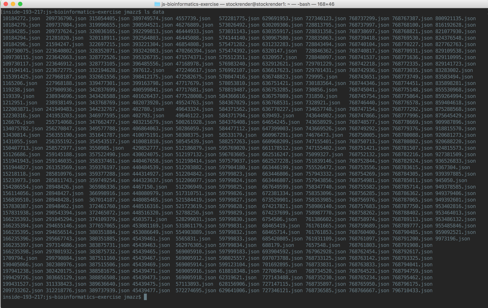

# js-bioinformatics-exercise

The tutorial for this [exercise][exercise] as part of my presentation on [JavaScript and Bioinformatics][js-and-bioinformatics].

[exercise]: https://slides.com/jmazz/js-bioinformatics/fullscreen#/37
[js-and-bioinformatics]: https://slides.com/jmazz/js-bioinformatics/fullscreen

## Setting up the project

The first thing you do when starting any modern JavaScript project is initialize
it (`cd` into your project directory and):

```bash
npm init
```

You will be asked to provide values for certain keys. The `name` will default to
the current directory. It's perfectly fine to just enter through everything.
This will create a `package.json` file. This file defines everything about your
package in order to publish it to npm, define  development dependencies and
project dependencies, to run arbitrary scripts, as well as interoperate with
other tools. For example, linters, like [jshint][jshint] can have it's options
specified from either a `.jshintrc` file or inside `package.json` under the
`jshint` key. After running this, my `package.json` looks like this (I switched
to MIT license):

```json
{
  "name": "js-bioinformatics-exercise",
  "version": "1.0.0",
  "description": "The tutorial for this [exercise][exercise] as part of my presentation on [JavaScript and Bioinformatics][js-and-bioinformatics].",
  "main": "index.js",
  "scripts": {
    "test": "echo \"Error: no test specified\" && exit 1"
  },
  "repository": {
    "type": "git",
    "url": "git+https://github.com/thejmazz/js-bioinformatics-exercise.git"
  },
  "author": "",
  "license": "MIT",
  "bugs": {
    "url": "https://github.com/thejmazz/js-bioinformatics-exercise/issues"
  },
  "homepage": "https://github.com/thejmazz/js-bioinformatics-exercise#readme"
}
```

## Getting Dependencies

Let's get started by downloading [bionode-ncbi][bionode-ncbi] **and** making
sure to store it under our dependencies by using the `--save` option:

```bash
npm install bionode-ncbi --save
```

You'll now notice the following has been added to the `package.json`

```json
{
    "dependencies": {
        "bionode-ncbi": "^1.6.0"
    }
}
```

As well, `bionode-ncbi` lives at `node_modules/bionode-ncbi`. You don't commit
this `node_modules` folder - when someone downloads this package they can simply
run `npm install` and it will install everything under the `dependencies` and
`devDependencies` keys. Thus managing dependencies in the npm ecosystem is
simple *and* robust. Note as well, when we installed bionode-ncbi, it ran `npm
install` inside the bionode-ncbi folder, and ever deeper for each dependency.

## bionode-ncbi

Refer to my [slide][slide-bionode-ncbi-api] overviewing the bionode-ncbi API.


This allows us to access the NCBI [E-utilities][e-utilities] through callbacks,
events, and streams. Which to use is up to you. Check out
[try-bionode-esnext][try-bionode-esnext]. This uses ES6 syntax but the concepts
are the same. For this tutorial I'll stick to ES5 however. Let's start writing
`main.js`:

```js
var ncbi = require('bionode-ncbi');
var fs = require('fs');

var query = ncbi.search('protein', 'mbp1');

function dataLogger(data) {
    // Assumes `data` directory already exists
    var fileName = 'data/' + data.uid + '.json';
    fs.writeFileSync(fileName, JSON.stringify(data));
    console.log('Wrote ' + fileName);
}

query.on('data', dataLogger);
```

We require `bionode-ncbi` and `fs` (filesystem) modules. `query` is the object
returned by `ncbi.search`. It emits a `data` event, which we catch and pass
`dataLogger` as the callback. This simply writes the retrieved JSON to the
folder `data`. (You will need to `mkdir data` first - just didn't want to
introduce checking if the dir exists, then make it, etc. into this minimal
example).

At this point you can `ls data` and see what turned up!



There are quite a lot of results. These are all from different organisms. 

[jshint]: http://jshint.com/
[bionode-ncbi]: https://github.com/bionode/bionode-ncbi
[slide-bionode-ncbi-api]: http://slides.com/jmazz/js-bioinformatics/fullscreen#/11
[e-utilities]: http://www.ncbi.nlm.nih.gov/books/NBK25500/
[try-bionode-esnext]: https://gist.github.com/thejmazz/fbec1d50e6ed14401ad9
