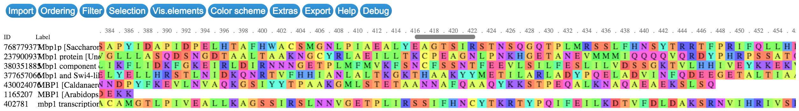
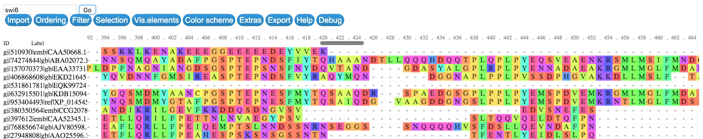

# js-bioinformatics-exercise

The tutorial for this [exercise][exercise] as part of my presentation on [JavaScript and Bioinformatics][js-and-bioinformatics]. Here it is an overview as a [slide deck](https://thejmazz.github.io/pres-bionode-r).

[exercise]: https://slides.com/jmazz/js-bioinformatics/fullscreen#/37
[js-and-bioinformatics]: https://slides.com/jmazz/js-bioinformatics/fullscreen

This tutorial will walk you through creating a small web app which
* accesses the NCBI with [bionode-ncbi][bionode-ncbi]
* performs a multiple sequence alignment with [muscle][muscle] through [msa][msa]
* visualizes the results with [biojs-msa][biojs-msa]

First, an introduction to creating an npm package and installing dependencies.
Consuming *and* producing functions with the callback style will be explained,
as well as providing ample experience with Node's [streams][streams]. You will
construct a (simple) RESTful API with [Express][express].
[browserify][browserify] will be demonstrated as a tool for bundling code,
letting you use npm packages in the browser. Interoperability with R will be
achieved by communicating between Node and an R script with stdio pipes and
[jsonlite][jsonlite].

Note, none of the heavy algorithmic lifting will be performed by JavaScript. So
why then this push for **scientific computing in JS**? Well speed and memory
intensive programs are nearly always written in C/C++. For example, msa from
Bioconductor provides an "interface to the multiple sequence alignment
algorithms ClustalW, ClustalOmega, and Muscle". [SciPy][SciPy] also uses native
code. JavaScript engines such as [V8][V8] from Google,
[SpiderMonkey][SpiderMonkey] from Mozilla and [Chakra][Chakra] from Microsoft
Edge have been getting faster and faster. See  [JS vs Python][JSvsPython] and
these [benchmarks][benchmarks] from the Julia project. Speed is important for
large tasks yes, but languages are normally chosen over others for their
available packages. While it is true npm is the largest collection of open
source modules, these are mostly related to web development.  The communities
for scientific computing in Python/CPython and bioinformatics in R with
bioconductor have years of development and much more refined packages to chose
from. But..the heavy lifting..is still done in C.  C can and has been wrapped in
Node in a variety of modules (see: [node-gyp][node-gyp]). V8 *is* C++ after all. Furthermore
[emscripten][emscripten] is a [LLVM][LLVM]-to-JavaScript compiler. It can
compile into [asm.js][asm.js] which is a low-level subset of JS. Engines can
recognize asm and make optimizations - you can end up with native code running
as JS in the browser at about 70% the speed! Another exciting development is
[WebAssembly][WebAssembly] - it
will let you compile C into a binary format that can run in the browser, with more
languages coming down the road. So is
the future set? Will scientific computing in JS become popular? I sure hope so:

* JS is the **language of the web** and is here to stay *and* evolve
* The *best* way to share **high fidelity data visualizations** is over the browser with JS and WebGL
* Electron can be used to create cross-platform desktop apps written in JS with file system access
* C programs can be **wrapped in Node** and are beginning to be compiled into asm.js. Thus the only boundary to msa for instance being implemented in Node is developers to write the glue.
* **WebAssembly is coming**!
* JS for searching and downloading data can be used on the **server and in the browser**. This can simplify development of bioinformatics web applications.

For more discussions regarding the implementation of these technologies and others
(GPU computation for example), see [codeforscience/webdata](https://github.com/codeforscience/webdata/blob/master/README.md).
As well a talk from Max Ogden of the Dat project, [JavaScript, For Science!](https://www.youtube.com/watch?v=_3oykSKOito).

[node-gyp]:https://github.com/nodejs/node-gyp
[SciPy]:http://www.scipy.org/
[WebAssembly]:https://medium.com/javascript-scene/what-is-webassembly-the-dawn-of-a-new-era-61256ec5a8f6#.sxsmd4vyp
[asm.js]:https://github.com/dherman/asm.js/
[LLVM]:https://en.wikipedia.org/wiki/LLVM
[emscripten]:http://kripken.github.io/mloc_emscripten_talk/#/
[benchmarks]:http://julialang.org/benchmarks/
[JSvsPython]:http://benchmarksgame.alioth.debian.org/u64q/compare.php?lang=v8&lang2=python3
[V8]:https://developers.google.com/v8/?hl=en
[biojs-msa]:http://msa.biojs.net/
[muscle]:http://www.biomedcentral.com/content/pdf/1471-2105-5-113.pdf
[msa]:https://bioconductor.org/packages/release/bioc/html/msa.html
[streams]:https://nodejs.org/api/stream.html
[jsonlite]:https://cran.r-project.org/web/packages/jsonlite/jsonlite.pdf
[browserify]:http://browserify.org/
[SpiderMonkey]:https://developer.mozilla.org/en-US/docs/Mozilla/Projects/SpiderMonkey
[Chakra]:https://blogs.windows.com/msedgedev/tag/chakra/

Table of Contents
=================

* [Setting up the project](#setting-up-the-project)
* [Getting Dependencies](#getting-dependencies)
* [bionode\-ncbi](#bionode-ncbi)
* [Static File Server with Express](#static-file-server-with-express)
* [NCBI Fetch](#ncbi-fetch)
* [Callbacks](#callbacks)
* [Pipes](#pipes)
* [Into the Browser](#into-the-browser)
* [BioJS: MSA](#biojs-msa)
* [Interoperability with R](#interoperability-with-r)

## Setting up the project

[Install Node](https://gist.github.com/thejmazz/72456e3f29cf0bf56d4a) if you haven't done so already. The first thing you do when starting any modern JavaScript project is initialize
it (`cd` into your project directory and):

```bash
npm init
```

You will be asked to provide values for certain keys. The `name` will default to
the current directory. It's perfectly fine to just enter through everything.
This will create a `package.json` file. This file defines everything about your
package in order to publish it to npm, define  development dependencies and
project dependencies, to run arbitrary scripts, as well as interoperate with
other tools. For example, linters, like [jshint][jshint] can have it's options
specified from either a `.jshintrc` file or inside `package.json` under the
`jshint` key. After running this, my `package.json` looks like this (I switched
to MIT license):

```json
{
  "name": "js-bioinformatics-exercise",
  "version": "1.0.0",
  "description": "The tutorial for this [exercise][exercise] as part of my presentation on [JavaScript and Bioinformatics][js-and-bioinformatics].",
  "main": "index.js",
  "scripts": {
    "test": "echo \"Error: no test specified\" && exit 1"
  },
  "repository": {
    "type": "git",
    "url": "git+https://github.com/thejmazz/js-bioinformatics-exercise.git"
  },
  "author": "",
  "license": "MIT",
  "bugs": {
    "url": "https://github.com/thejmazz/js-bioinformatics-exercise/issues"
  },
  "homepage": "https://github.com/thejmazz/js-bioinformatics-exercise#readme"
}
```

## Getting Dependencies

Let's get started by downloading [bionode-ncbi][bionode-ncbi] **and** making
sure to store it under our dependencies by using the `--save` option:

```bash
npm install bionode-ncbi --save
```

You'll now notice the following has been added to the `package.json`

```json
{
    "dependencies": {
        "bionode-ncbi": "^1.6.0"
    }
}
```

As well, `bionode-ncbi` lives at `node_modules/bionode-ncbi`. You don't commit
this `node_modules` folder - when someone downloads this package they can simply
run `npm install` and it will install everything under the `dependencies` and
`devDependencies` keys. Thus managing dependencies in the npm ecosystem is
simple *and* robust. Note as well, when we installed bionode-ncbi, it ran `npm
install` inside the bionode-ncbi folder, and ever deeper for each dependency.

## bionode-ncbi

Refer to my [slide][slide-bionode-ncbi-api] overviewing the bionode-ncbi API.


This allows us to access the NCBI [E-utilities][e-utilities] through callbacks,
events, and streams. Which to use is up to you. Check out
[try-bionode-esnext][try-bionode-esnext]. This uses ES6 syntax but the concepts
are the same. For this tutorial I'll stick to ES5 however. Let's start writing
`main.js`:

```js
var ncbi = require('bionode-ncbi');
var fs = require('fs');

var query = ncbi.search('protein', 'mbp1');

function dataLogger(data) {
    // Assumes `data` directory already exists
    var fileName = 'data/' + data.uid + '.json';
    fs.writeFileSync(fileName, JSON.stringify(data));
    console.log('Wrote ' + fileName);
}

query.on('data', dataLogger);
```

We require `bionode-ncbi` and `fs` (filesystem) modules. `query` is the object
returned by `ncbi.search`. It emits a `data` event, which we catch and pass
`dataLogger` as the callback. This simply writes the retrieved JSON to the
folder `data`. (You will need to `mkdir data` first - just didn't want to
introduce checking if the dir exists, then make it, etc. into this minimal
example).

To run this,

```bash
node main.js
```

At this point you can `ls data` and see what turned up!

## Static File Server with Express

There are quite a lot of results. These are all from different organisms. To be
able to quickly browse through them, we can set up an [express][express] static
file server with [serve-index][serve-index], in `server.js`:

```js
var express = require('express');
var serveIndex = require('serve-index');

var app = express();

app.use(serveIndex('data'));
app.use(express.static('data'));

app.listen(3000);

console.log('Express server listening on port 3000');
```

Start the server with `node server.js` and navigate to `http://localhost:3000` in
your web browser. You can now easily browse through the files. I *highly*
recommend the Chrome addon [JSON
Formatter](JSON-Formatter). This is what you should see:


Would be nice to implement left/right arrow to move between the files..but for
now this suits our purposes to get a quick overview of the data we are dealing
with and the general format. One way to generate a generic schema would be to
loop through each file and keep track of the keys and `typeof(result[key])` that
are common among all.

Take a look at [1431055.json][1431055.json]. Disclaimer: I got `1431055` from
the web results - instead of looking through each file - we could do that
programmatically of course though.

## NCBI Fetch

We have all these results for Mbp1 proteins in different organisms - why not
run an MSA and see if any regions are more conserved than others? To do this
we will need to retrieve sequences. For that, we can use the `fetch` function
from bionode-ncbi. Check out the table for [Entrez eFetch Databases](eFetch).
Run the following just to test it out (after installing bionode-ncbi globally
so we can use it in the shell - `npm install -g bionode-ncbi`):

```bash
bionode-ncbi fetch protein 1431055
```

This returns:

```json
{
    "id":"gi|1431055|emb|CAA98618.1| MBP1 [Saccharomyces cerevisiae]",
    "seq":"MSNQIYSARYSGVDVYEFIHSTGSIMKRKKDDWVNATHILKAANFAKAKRTRILEKEVLKETHEKVQGGFGKYQGTWVPLNIAKQLAEKFSVYDQLKPLFDFTQTDGSASPPPAPKHHHASKVDRKKAIRSASTSAIMETKRNNKKAEENQFQSSKILGNPTAAPRKRGRPVGSTRGSRRKLGVNLQRSQSDMGFPRPAIPNSSISTTQLPSIRSTMGPQSPTLGILEEERHDSRQQQPQQNNSAQFKEIDLEDGLSSDVEPSQQLQQVFNQNTGFVPQQQSSLIQTQQTESMATSVSSSPSLPTSPGDFADSNPFEERFPGGGTSPIISMIPRYPVTSRPQTSDINDKVNKYLSKLVDYFISNEMKSNKSLPQVLLHPPPHSAPYIDAPIDPELHTAFHWACSMGNLPIAEALYEAGTSIRSTNSQGQTPLMRSSLFHNSYTRRTFPRIFQLLHETVFDIDSQSQTVIHHIVKRKSTTPSAVYYLDVVLSKIKDFSPQYRIELLLNTQDKNGDTALHIASKNGDVVFFNTLVKMGALTTISNKEGLTANEIMNQQYEQMMIQNGTNQHVNSSNTDLNIHVNTNNIETKNDVNSMVIMSPVSPSDYITYPSQIATNISRNIPNVVNSMKQMASIYNDLHEQHDNEIKSLQKTLKSISKTKIQVSLKTLEVLKESSKDENGEAQTNDDFEILSRLQEQNTKKLRKRLIRYKRLIKQKLEYRQTVLLNKLIEDETQATTNNTVEKDNNTLERLELAQELTMLQLQRKNKLSSLVKKFEDNAKIHKYRRIIREGTEMNIEEVDSSLDVILQTLIANNNKNKGAEQIITISNANSHA"
}
```

## Callbacks

Sweet, so we will be able to get sequences. However, not all of the search
results are worth comparing - let's filter out the ones that have `mbp1` in
their title. The following code achieves that, in `collect-seqs.js`:

```js
var fs = require('fs');

// return array of uids of proteins with title containing `mbp1`
function filter(proteins, cb) {
    var num = 0;
    var filtered = [];

    var check = function(err, data) {
        if (err) cb(err);

        num+= 1;
        var obj = JSON.parse(data);
        if (obj.title !== undefined && obj.title.toUpperCase().indexOf('MBP1') >= 0) {
            filtered.push(obj.uid);
        }
        tryFinish();
    };

    var tryFinish = function() {
        if (num === proteins.length) {
            cb(null, filtered);
        }
    };

    proteins.forEach(function(protein) {
        fs.readFile('data/' + protein, check);
    });
}

filter(fs.readdirSync('data'), function(err, mbp1s) {
    if (err) console.error(err);

    mbp1s.forEach(function(uid) {
        fs.readFile('data/' + uid + '.json', function(err, data) {
            if (err) console.error(err);

            var obj = JSON.parse(data);
            console.log(obj.title);
        });
    });
});
```

Now, that's pretty callback heavy. What is happening here and why? JavaScript
has one event loop, and only one function can run at a time. Thus the standard
way to *consume* asynchronous operations (i.e. those which will take time - for
example, reading the contents of a file or waiting for a web request) is
the idiomatic `function(err,data)`. For example, reading a file:

```js
fs.readFile('arbitraryBytes.ab', function(err, data) {
    // handle error (poorly in this case)
    if (err) console.error(err);

    // do stuff with data!
    var obj = JSON.parse(data);
})
```

But how do we *produce* these asynchronous operations? We define a function
that takes a **callback** function as a parameter. Then when everything is
really done, we call that function with our result: `cb(null, data)` or if
something goes wrong, pass the error to it: `cb(err)`.

So what is happening in `filter`? First, we read every file that was passed
in:

```
proteins.forEach(function(protein) {
    fs.readFile('data/' + protein, check);
});
```

Instead of writing an inline function, `check` is declared elsewhere. `check` is
an *impure* function which has side effects - it increments `num` each time it
is called. When `check` is finished what it it will call `tryFinish`.
`tryFinish` simply checks if `num === proteins.length`, i.e. have all the files
been read and parsed. We do not know the order that these files were processed -
and it will be different each time. Thus, an alternative is to assign the result
into a fixed index in an array (yes, `var a = []; a[5] = 'five'` is totally
valid JS). In this case the order is not too important so I just threw the uids
in there. Finally, when `tryFinish` discovers that we have in fact processed
every file, it calls `cb` with the `null` as the error, and the produced data.

You might be beginning to notice what is called **callback hell**. There are
methods to avoid this endlessly indented dread however - you can chain
`.then()`s of [Promises][promise-mdn] (See also
[bluebird](https://github.com/petkaantonov/bluebird),
[q](https://github.com/kriskowal/q)). ES6 introduces
[generators](http://www.2ality.com/2015/03/no-promises.html) which are a neat
type of "iterator" that you can pass in data to them mid state with
`next(datum)`. Promises and generators can be combined (in a way which was not
originally intended but works great!) and ran through a "generator engine" of
some sort (like [co](https://github.com/tj/co)) and the result is **asynchronous
code that looks synchronous**. Co essentially implements what is in the draft
for ES7, `async/await`. Check out [try-bionode-esnext][try-bionode-esnext] to
see this next-next-generation JS put to use to consume callbacks without
indenting. Browsers are [beginning to
implement](https://kangax.github.io/compat-table/es6/) ES6 features, in the
meantime you can use [Babel](http://babeljs.io/) to transpile ES6 into ES5.
Extra note: `Promise.all([...])` is also quite useful and can be used to wait
for a bunch of async operations to finish.

That was quite a bit. But if you got here, and understand `collect-seqs.js`
thats great. Coming to grips with callbacks is central to understanding how
async operations are handled in a language that runs on one thread. You may
think, wow, one thread that doesn't sound too great! But it actually makes for
easily scalable RESTful APIs - on any request the server can take it without
being stuck handling someone else - the callbacks will flow in when they are
ready.  

Take a look at the [output][collect-seqs-output] `node collect-seqs.js`
produces.

## Pipes

As you can see, this data filtering pipeline which has been developed so far is
beginning to become clouded by async idioms and basically - code. It's important
to keep a clear and concise focus on what our code should achieve and how the
purpose is readable from an outside observer. Yes, new ES6/ES7 features can make
it much cleaner, but we are wasting time repeatedly writing and reading files.
Wouldn't it be great if there was some way to process data piece by piece as it
came in from the Internet? It would - and this is called a
[stream](https://nodejs.org/api/stream.html). If there is a package for R for
dealing with BLOB streams please let me know, a quick Google search brought
[this](https://cran.r-project.org/web/packages/stream/vignettes/stream.pdf) but
that does not appear at first glance terribly similar. Stream support in R would
make for fantastic interoperability with bionode/gasket.

Lets revisit this data acquisition and filtering pipeline in the context of the
stream APIs bionode provides, in `piped.js`:

```js
var ncbi = require('bionode-ncbi');
var es = require('event-stream');
var filter = require('through2-filter');

ncbi.search('protein', 'mbp1')
    .pipe(filter.obj(function (obj) {
        return obj.title.match(/^mbp1p?.*\[.*\]$/i);
    }))
    .pipe(es.through(function (data) {
        this.emit('data', data.title + '\n');
    }))
    .pipe(process.stdout);
```

That produces this [output](https://github.com/thejmazz/js-bioinformatics-exercise/blob/master/outputs/piped1.txt).

Why didn't we just do this in the first place you might ask? It's very important
to understand callbacks - also, these different approaches may be superior
in different scenarios.

Lets filter it down to just different species, extract the `gi` id,
and fetch the sequence. In `piped2.js`:

```js
var ncbi = require('bionode-ncbi');
var es = require('event-stream');
var filter = require('through2-filter');
var concat = require('concat-stream');
var tool = require('tool-stream');

var concatStream = concat(function(array) {
    console.log(array);
});

var species = [];

ncbi.search('protein', 'mbp1')
    .pipe(filter.obj(function (obj) {
        return obj.title.match(/^mbp1p?.*\[.*\]$/i);
    }))
    .pipe(filter.obj(function (obj) {
        var specieName = obj.title.substring(obj.title.indexOf('[') + 1, obj.title.length-1);
        specieName = specieName.split(' ').slice(0,1).join(' ');
        if (species.indexOf(specieName) >= 0) {
            return false;
        } else {
            species.push(specieName);
            return true;
        }
    }))
    .pipe(tool.extractProperty('gi'))
    .pipe(ncbi.fetch('protein'))
    .pipe(concatStream);
```

and produces this
[output][piped2.txt] which is an array of objects. Note the sequences are of
quite varying lengths. For now, we won't perform a MSA and will view it
in the browser with biojs-msa as if they all align from the start. Why?
That we can do totally within the browser - but as far as I know there is
no MSA implementation in JavaScript.

## Into the Browser

At the moment, there is no standard way of importing modules in the browser.
That is, `require` is undefined. With ES6 `import` and `export` will be
available! We will use [Browserify](http://browserify.org/) to bundle our
scripts from an entry point. Install browserify (`npm install -g browserify`)
and bundle `piped2.js` into `bundle.js` with the debug option so we get source
maps:

```bash
browserify piped2.js -o public/bundle.js --debug
```

Now, I actually get an error doing this:

```bash
Error: Cannot find module 'browserify-fs' from '/Users/jmazz/Documents/repos/js-bioinformatics-exercise/node_modules/bionode-ncbi/node_modules/bionode-fasta/lib'
    ...
```

Perhaps someone missed the `--save` on `npm install browserify-fs`. Looking into
`node_modules/bionode-ncbi/node_modules/bionode-fasta/package.json`, indeed, it
is not in `dependencies`. But it is in `devDependencies`! And as well there is:

```json
"browser": {
    "fs": "browserify-fs"
}
```

The `browser` object is for browserify. So there definitely has been attempt
to make this work. Either way, we can get around this by doing

```
browserify piped2.js -o public/bundle.js --debug -r fs:browserify-fs
```

as I gathered from the [browserify-fs readme](https://www.npmjs.com/package/browserify-fs). Another solution would
have been to `npm install browserify-fs` inside `bionode-fasta`. However you
should avoid modifying dependencies - and if you do - you should issue a pull
request.

Then create a simple `public/index.html` (I got the css from
[here](https://cdn.biojs.net/msa/0.3/msa.min.gz.css)):

```html
<!doctype html>
<html>
    <head>
        <title biojs msa visualization> </title>
        <link rel="stylesheet" href="msa.min.css" />
    </head>
    <body>
        <script src="bundle.js"></script>
    </body>
</html>
```

With some small modifications to `server.js` we can get this running (It's important
to run through a localhost since opening html files with the browser doesn't let
you do as many things):

```js
app.use('/data', serveIndex('data'));
app.use('/data', express.static('data'));

app.use(express.static('public'));
```

View it in chrome and open up developer tools (`cmd`+`option`+`i` on OS X, or right-click->inspect). You will see there is an error:

```
Uncaught TypeError: Cannot read property 'write' of undefined, index.js:6
```

Expanding the error and looking through the trace, I find that line 43 makes
this call:

```js
module.exports.stdout = module.exports(process.stdout);
```

where in line 5 and 6 we have

```js
module.exports = function(stream) {
    var write = stream.write;
    // ...
}
```

Hmm, do we have `process` in the browser? Nope. Hence `process.stdout.write`
will fail. Browserify is supposed to replace these things - see [advanced
options](https://github.com/substack/node-browserify#usage). However, I think
this requires `require('process')` to work? Passing in `--insert-globals` didn't
do the trick either. After inspecting the code this was my hacky fix:

In `node_modules/bionode-ncbi/node_modules/nugget/package.json` I added

```json
"browser": {
    "single-line-log": false
}
```

Essentially just ignoring the module that is causing the issue. This is safe
because `single-line-log` won't get used unless we use the `verbose` option -
which apparently is not being passed due to this hack working..
[browser-stdout](https://github.com/kumavis/browser-stdout) and
[process](https://www.npmjs.com/package/process) exist, and perhaps I'll put
together a pull request implementing those sometime.

Note: Most of the time, browserify works wonderfully! Pure-js modules will
always work. Obviously there will be some issues when porting Node server code
into the browser. It's unlikely the
[single-line-log](https://github.com/freeall/single-line-log) author expected
his module to be used in the browser.

I've written
[fix-nugget](https://github.com/thejmazz/js-bioinformatics-exercise/blob/master/fix-nugget.js)
for this, and added it the postinstall script. So now at least anyone pulling
*this* repository won't have those issues.

## BioJS: MSA

Browsing through the [msa readme](https://github.com/greenify/msa), I took the
"b) Import your own seqs" snippet and the "sequence model", to produce `msa.js`:

```js
var msa = require("msa");
// other requires from piped2.js

var msaDiv = document.createElement('div');
document.body.appendChild(msaDiv);

var concatStream = concat(function(sequences) {
    sequences = sequences.map(function(seq) {
        var props = seq.id.split('|');
        seq.id = props[1];
        seq.name = props[4];
        return seq;
    });

    console.log(sequences);
    var m = new msa({
        el: msaDiv,
        seqs: sequences
    });
    m.render();
});

// ncbi.search from piped2.js
```

Then ran `npm run bundle`. (see `scripts` in `package.json`).

Here's what it looks like! Be sure to play a bit with the controls. You
can change row order and find motifs (via RegEx) for example.



## Interoperability with R

Check
[piped3.js](https://github.com/thejmazz/js-bioinformatics-exercise/blob/master/piped3.js).
It produces a `.ndjson` file, or newline delimited JSON. It's output is in
[seqs.ndjson](https://github.com/thejmazz/js-bioinformatics-exercise/blob/master/outputs/seqs.ndjson).
Using that as input, the msa bioconductor package produces
[seqsAligned.ndjson](https://github.com/thejmazz/js-bioinformatics-exercise/blob/master/outputs/seqsAligned.ndjson).
But these are files. We want to work with streams!

[jsonlite](https://cran.r-project.org/web/packages/jsonlite/jsonlite.pdf) on CRAN
supports streaming of JSON, but only through ndjson. The following R script
uses [msa](https://bioconductor.org/packages/release/bioc/html/msa.html) from
Bioconductor to align our sequences. In `msa.r`:

```r
#!/usr/bin/env rscript

# Packages
if (!require(Biostrings, quietly=TRUE)) {
    source("https://bioconductor.org/biocLite.R")
    biocLite("Biostrings")
}
data(BLOSUM62)

if (!require(msa, quietly=TRUE)) {
    source("https://bioconductor.org/biocLite.R")
    biocLite("msa")
    library(msa)
}

if (!require(jsonlite, quietly=TRUE)) {
    install.packages("jsonlite")
}

# Open stdin connection
stdin <- file("stdin")
open(stdin)

# jsonlite parse stdin ndjson into data frame
seqs <- stream_in(stdin, verbose=FALSE)

# Create AAStringSet vector out of sequences
seqSet <- AAStringSet(c(seqs$seq))
# Make sure to set names so we can identify later!
seqSet@ranges@NAMES <- seqs$id

# Compute alignment with MUSCLE
msa <- msaMuscle(seqSet, order="aligned")

# Alter values in seqs data frame
for (i in 1:nrow(msa)) {
    seqs$id[i] = msa@unmasked@ranges@NAMES[i]
    seqs$seq[i] = as.character(msa@unmasked[i][[1]])
}

# Back to stdout
stream_out(seqs, verbose=FALSE)
```

Now, how to interact with this and JS? Well, its impossible to do it in the
browser. We can integrate this script into an Express API easily and then
request the aligned sequences from the frontend. R  has support for pipes and
socket connections, which `stream_in` and `stream_out` from jsonlite can use. So
perhaps this R script can be made to fit into the stream in Node. To use `msa.r`
as a child process, it needs to be executable: `chmod u+x msa.r`. See
`streamMsa.js`:

```js
var ncbi = require('bionode-ncbi');
var es = require('event-stream');
var filter = require('through2-filter');
var concat = require('concat-stream');
var tool = require('tool-stream');
var cp = require('child_process');
var ndjson = require('ndjson');

// Only supports one level deep property
// i.e. car['wheels'] and not car['wheels.tire']
// for that, do car.wheels['tire']
function propMatchRegex(obj, prop, regex) {
    return obj[prop].match(regex);
}

function getProteinSeqs(req, res, next) {
    var opts = req.opts;

    // var species = [];
    var rMSA = cp.spawn('/Users/jmazz/r/js-bioinformatics-exercise/msa.r');

    var stream = ncbi.search('protein', opts.query);

    opts.filters.forEach(function (f) {
        stream = stream.pipe(filter.obj(f));
    });

    if (opts.uniqueSpecies) {
        // This will actually belong to scope of function
        var species=[];

        stream = stream
            .pipe(filter.obj(function (obj) {
                var specieName = obj.title.substring(obj.title.indexOf('[') + 1, obj.title.length-1);
                specieName = specieName.split(' ').slice(0,1).join(' ');
                if (species.indexOf(specieName) >= 0) {
                    return false;
                } else {
                    species.push(specieName);
                    return true;
                }
            }));
    }

    stream
        .pipe(tool.extractProperty('gi'))
        .pipe(ncbi.fetch('protein'))
        .pipe(es.through(function (obj) {
            this.emit('data', JSON.stringify(obj) + '\n');
        }))
        .pipe(rMSA.stdin);

    var seqs=[];
    rMSA.stdout
        .pipe(ndjson.parse())
        .on('data', function(data) {
            seqs.push(data);
        })
        .on('end', function() {
            res.send({
                seqs: seqs
            });
        });
}

module.exports = {
    getProteinSeqs: getProteinSeqs,
    propMatchRegex: propMatchRegex
};
```

The corresponding GET request at `/aligned` in `server.js`:

```js
var bodyParser = require('body-parser');
app.use(bodyParser.urlencoded({extended: true}));

var sMsa = require('./streamMsa');
var propMatchRegex = sMsa.propMatchRegex;
var getProteinSeqs = sMsa.getProteinSeqs;

// e.g. /aligned?q=mbp1
app.get('/aligned', [
    function (req, res, next) {
        req.opts = {
            query: req.query.q,
            vars: {
                species: []
            },
            filters: [
                function(obj) {
                    // e.g. /^mbp1.*\[.*\]$/i)
                    var regex = new RegExp('^' + req.query.q + '.*\\[.*\\]$', 'i');
                    return propMatchRegex(obj, 'title', regex);
                }
            ],
            uniqueSpecies: true
        };

        next();
    },
    getProteinSeqs
]);
```

Here our "handler stack" is an array of functions which follow `function
(request, response, next)`. We attach `opts` to the `req` object so
`getProteinSeqs` can retrieve them.  See [writing
middleware](http://expressjs.com/en/guide/writing-middleware.html) for more
info. [body-parser](https://www.npmjs.com/package/body-parser) is middleware
which creates an object of url queries for you at `req.query`. It can also
parse JSON (e.g. from PUT bodies) but we don't use that.

I modularized `msa.js` a bit and added a little jQuery:

```js
function runFetch() {
    $.get('http://localhost:3000/aligned?q=' + $('#query').val()).then(function(data) {
        createMSAViz(data.seqs);
    });
}

$('#submit').on('click', function() {
    msaDiv.innerHTML = 'Loading...';
    runFetch();
});
```

Which needs this HTML:

```html
<input type="text" id="query" placeholder="query"></input>
<button id="submit">Go</button>
```

Now we have an actual MSA that takes a search query! It will filter
down to results to everything that starts with the query, then has anything,
then [specie], and only takes unique species. Of course it would be nicer
to provide all these options from the interface but this serves as a minimal
example.




[jshint]: http://jshint.com/
[bionode-ncbi]: https://github.com/bionode/bionode-ncbi
[slide-bionode-ncbi-api]: http://slides.com/jmazz/js-bioinformatics/fullscreen#/11
[e-utilities]: http://www.ncbi.nlm.nih.gov/books/NBK25500/
[try-bionode-esnext]: https://gist.github.com/thejmazz/fbec1d50e6ed14401ad9
[express]: http://expressjs.com/en/index.html
[serve-index]: https://github.com/expressjs/serve-index
[JSON-Formatter]: https://chrome.google.com/webstore/detail/json-formatter/bcjindcccaagfpapjjmafapmmgkkhgoa?hl=en
[eFetch]: http://www.ncbi.nlm.nih.gov/books/NBK25497/table/chapter2.T._entrez_unique_identifiers_ui/?report=objectonly
[collect-seqs-output]: https://github.com/thejmazz/js-bioinformatics-exercise/blob/master/outputs/collect-seqs.txt
[promise-mdn]:https://developer.mozilla.org/en/docs/Web/JavaScript/Reference/Global_Objects/Promise
[piped2.txt]:https://github.com/thejmazz/js-bioinformatics-exercise/blob/master/outputs/piped2.txt
[1431055.json]:https://github.com/thejmazz/js-bioinformatics-exercise/blob/master/outputs/1431055.json
